# TCurve
:stem: latexmath

This document describes the implementation details of the TCurve class.

A TCurve class holds the user-provided data that defines the centre-line curve used by a Template.

Within a TCurve, there is an instance FCurveCalculator of a TCurveCalculator class that performs the calculations for a curve.

The FCurveCalculator can be either a TSlewCalculator or a TCurveSegmentCalculator. The TSlewCalculator will only be present if slewing has been
defined for this template, and applies the slew calculations to the underlying curve (This is an example of a Decorator Pattern, 
see https://en.wikipedia.org/wiki/Decorator_pattern).

The TCurveSegmentCalculator contains a list of TCurveSegment objects that actually calculate information about each section of a curve.

[plantuml, diagram-classes, png]
....
class TCurve
interface ICurveParameters
abstract class TCurveCalculator
class TSlewCalculator
class TCurveSegmentCalculator

abstract class TCurveSegment
class TStraightSegment
class TCircleSegment
class TTransitionSegment

TCurve *-- "1" TCurveCalculator
TCurve .|> ICurveParameters
TCurveCalculator <|-- TSlewCalculator
TCurveCalculator <|-- TCurveSegmentCalculator

TSlewCalculator *- "1" TCurveSegmentCalculator

TCurveSegmentCalculator *- "*" TCurveSegment
TCurveSegment <|-- TStraightSegment
TCurveSegment <|-- TCircleSegment
TCurveSegment <|-- TTransitionSegment
....

The user-defined properties of a Curve are:
[cols="1,1"]
|===
| isSpiral
| Determines is this is a transition curve. If false, then only the stem:[nominalRadius] property is used

| nominalRadius
| The initial radius for the curve. A positive radius is a curve to the left (anti-clockwise), and a negative radius curves to the right (clockwise). 
  If stem:[abs(nominalRadius) \gt max\_rad\_test] then the segment will be straight.

| nominalRadius2
| The final radius for the curve (only for transition curves). 

| distanceToTransition
| The distance along the curve before the start of the transition. The curve before this point will be at stem:[nominalRadius]

| transitionLength
| The length of the transition segment of the curve. The curve beyond stem:[distanceToTransition + transitionLength] will be at stem:[nominalRadius2]

| isSlewing
| Determines whether a _slew_ is applied to this curve

| distanceToStartOfSlew
| The distance along the curve to the start of the slew zone

| slewLength
| The length of the slew zone

| slewAmount
| The horizontal amount of slewing to be applied to the curve (positive if the curve is moved to the left, negative to the right)

| slewMode
| Mode eSM_Cosine uses a cosine function to calculate the slew. Mode eSM_TanH uses a hyperbolic tan function for calculating the slew.

| slewFactor
| Only used for mode 2 (hyperbolic tan). This modifies the shape of the slewed curve.
|===

TCurve provides a public method to calculate curve information:
[source,pascal]
....
  procedure CalculateCurveAt(distance: double; out pt, direction: Tpex; out radius: double);
....

This method constructs the required TCurveCalculator and TCurveSegment objects, if necessary (ie if any user-defined properties have changed), and then 
determines which segment to call to calculate the curve information at the requested point.

The outputs of the CalculateCurveAt method are the point at the specified distance along the curve, the direction of the curve at the point, 
and the radius of the curve at that point.

Note that if the curve is slewed, the radius of the underlying curve is not adjusted to reflect the slew.

## CurveSegment Creation

The CurveSegments are created on-demand, whenever any calculated property or the TCurve class is accessed and the TCurve class is marked as being modified.

The Curve is first identified as being either Straight, Circular or Transition. For Straight or Circular a single CurveSegment of the 
appropriate type is created, with a length of stem:[maximum\_segment\_length]. 

stem:[maximum\_segment\_length] is a large value, that is effectively infinite

For a Transition Curve, either 2 or 3 CurveSegments will be created:

 * if stem:[distanceToTransition \gt 0] then either a TStraightSegment or TCircleSegment will be created, as appropriate based on stem:[nominalRadius], 
   with a length of stem:[distanceToTransition].
 * a TTransitionSegment is created, with a length of stem:[transitionLength].
 * a TStraightSegment or TCircleSegment is created, as appropriate based on stem:[nominalRadius2], with a length of stem:[maximum\_segment\_length].

Each CurveSegment is passed an initial point and direction. For the first CurveSegment, that will be the origin stem:[(0,0)] and the horizontal unit vector stem:[(1,0)]. 
For subsequent CurveSegments the initial point and direction will be the final point and direction of the preceding CurveSegment.

## TStraightSegment

A Straight Segment is defined by an origin and a direction (a 2D unit vector). Calculating a point on a straight line is a simple evaluation of:
[stem]
++++
pt = FOrigin + \vec{FDirection} * distance
++++

The returned direction will always be the segment stem:[FDirection] and the returned radius will always be stem:[max\_rad]

## TCircleSegment

A Circle Segment is defined by an origin (centre of the circle), the radius, and an angle offset.

The sign of the radius determines the direction of travel around the circle

To calculate the origin of the circle, we first calculate a normal vector by rotating the initialDirection by 90 degrees anti-clockwise. The origin is 
then:
[stem]
++++
FOrigin = initialPoint + \vec{normal} * radius
++++

The angle offset is also calculated using the normal vector (via arctan).

Calculating a point on the Circle Segment then requires calculating the angle of the desired point about the circle:
[stem]
++++
angle = FAngleOffset + distance/radius
++++

Once the angle is known, the point on the circle is calculated, and the direction is the tangent to the circle at that point, 
which is the angle plus 90 degrees.

## TTransitionSegment

A TransitionSegment defines a curve that changes smoothly from an initial radius (stem:[nominalRadius]) to a final radius (stem:[nominalRadius2]). 
The actual curve used is an Euler Spiral where the curvature changes linearly with the distance along the curve. See https://en.wikipedia.org/wiki/Euler_spiral
for some basic information on the Euler Spiral.

The steps to set up the calculations for the transition segment are:

. Convert the initial and final radius values to curvatures, using the relationship stem:[curvature = 1/radius]. The curvature when the curve is 
  straight is zero.
. Calculate the distance along from curve from where the curve is straight, to the point of maximum curvature. If the curvature is decreasing, then
  the startDistance will be negative.
. Calculate a scaling factor, which converts our distance values along the transition to distances along a geometrically equivalent spiral with 
  the property stem:[2R_cL_S = 1]. This is a special form of the Euler spiral called a Cornu spiral.
. Calculate the point and direction for the transition curve at the determined startDistance.
. Calculate a transformation (rotation and translation) that aligns the calculating start point and direction with the given initial point and 
  direction.

To calculate a point along the transition segment:

. Apply the start offset, and scaling factor to the given distance
. Solve the Fresnel integral for the Cornu spiral at the scaled distance
. Apply the scaling factor to determine the point along the curve.
. Calculate the direction of the curve at that point
. Apply the transformation to move the calculated point and direction to the final coordinate system.

There is also a calculated stem:[FDirectionSign] property that is either stem:[1] or stem:[-1], depending on whether the curve is 
turning to the left or the right.

## TSlewCalculator

If slewing has been specified for a curve, the curve is split into 3 zones: pre-slew, slew and post-slew.

The pre-slew zone follows the underlying curve.

The post-slew zone is offset from the underlying curve by the stem:[slewAmount].

In the slew zone the offset is calculated according to a function based on the stem:[slewMode].

### eSM_Cosine calculations

[stem]
++++
offset = \frac{slewAmount}{2} \cdot (1 - \cos( \frac{x \cdot \pi}{slewLength}))
++++

The first derivative of this is:

[stem]
++++
offset' = \frac{\pi \cdot slewAmount \sin(\frac{x \cdot \pi}{slewLength})}{2 \cdot slewLength}
++++

The first derivative is the slope of the offset function, and is used to adjust the curve direction of the underlying curve appropriately.

### eSM_TanH calculations

This is a more complex calculation as it has an additional stem:[slewFactor] parameter to control the shape of the slew curve.

stem:[slewFactor] specifies the range of the stem:[\tanh] function that will be used for the slew (in radians), from stem:[[-slewFactor,slewFactor]]. 

As we need to have first-order continuity between the underlying curve and the slew curve, we calculate the first derivative of stem:[tanh] at the slewFactor 
limit, and use this to calculate a rotation that will be applied to the function, such that the slope of the function at stem:[\tanh(slewFactor)] becomes 0.

The y value at this limit is the maximum y value we will get while evaluating the slew, so we scale values from the range stem:[[-y_{max},y_{max}]] to the 
range stem:[[0,slewAmount]]

As preparation, we need to know the value and first derivative of the tanh function at stem:[slewFactor]:
[stem]
++++
y = \tanh(slewFactor)
++++

[stem]
++++
y' = 1 - \tanh^2(slewFactor)
++++

We now need to calculate the sin and cos of the rotation angle, which we can do by constructing a vector from the first derivative, and normalising:

[stem]
++++
(r_{\cos}, r_{\sin}) = \frac{(1, y')}{\lvert (1, y') \rvert}
++++

We then want to rotate the end-point for the slew anti-clockwise (-ve) by the rotation angle, and look at just the y component which will give us the maximum value of the slew function 
which we will use to scale the result to the desired range.

[stem]
++++
y_{max} = -r_{\sin}slewFactor + r_{\cos}y
++++

To determine the slew offset for an arbitrary point, calculate the angle argument to tanh:
[stem]
++++
angle = 2 \cdot slewFactor \cdot (\frac{x}{slewLength} - 1/2)
++++

Calculate the stem:[\tanh] at that ange, rotate and scale:
[stem]
++++
offset = (-r_{\sin}angle + r_{\cos}\tanh(angle) + y_{max}) \frac{slewAmount}{2 \cdot y_{max}}
++++

Expand this to be in terms of stem:[x] (by substituting back the definition of angle), and differentiating, we get:
[stem]
++++
offset' = \frac{slewAmount \cdot slewFactor}{y_{max} \cdot slewLength}(-r_{\sin} + r_{\cos}\cdot(1 - \tanh^2(2 \cdot slewFactor \cdot (\frac{x}{slewLength} - 1/2))))
++++

